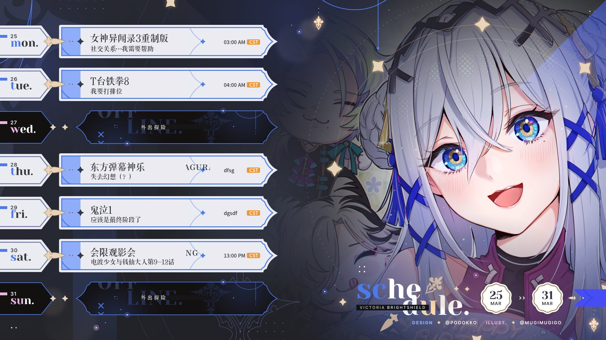

# Wish you a better future, Victoria.

A project to work out the translation of all vtuber's schedule is coming soon.

# README

This project is to help translating schedule of Victoria Brightshield(nijisanji) into Chinese(or any other language,whatever)

# Requirements

[python3](https://www.python.org/downloads/) needed

Pillow needed

```
pip install Pillow
```

# examples

cmd input

```
python3 GUItest.py
```

add input.png to the program


feedin the blanks


and find the `output.png` in project root directory



# TODO

double streams in one day

words to long to mask

add comments so that one can use this to work with other livers' schedule
